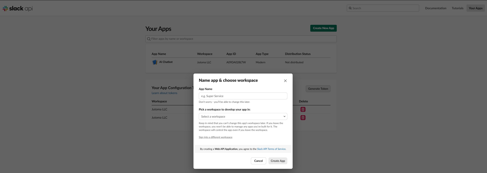
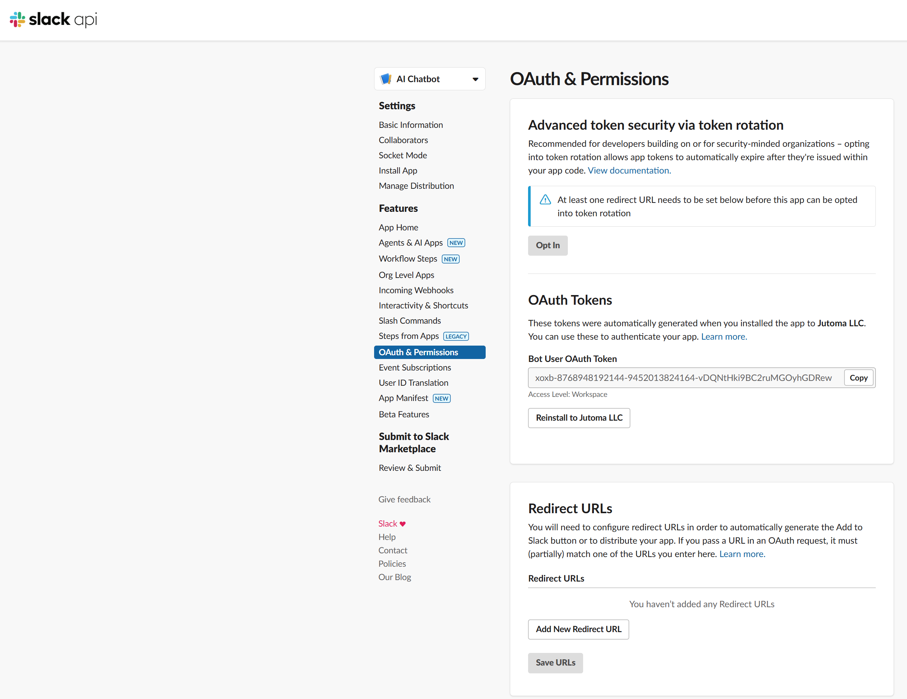
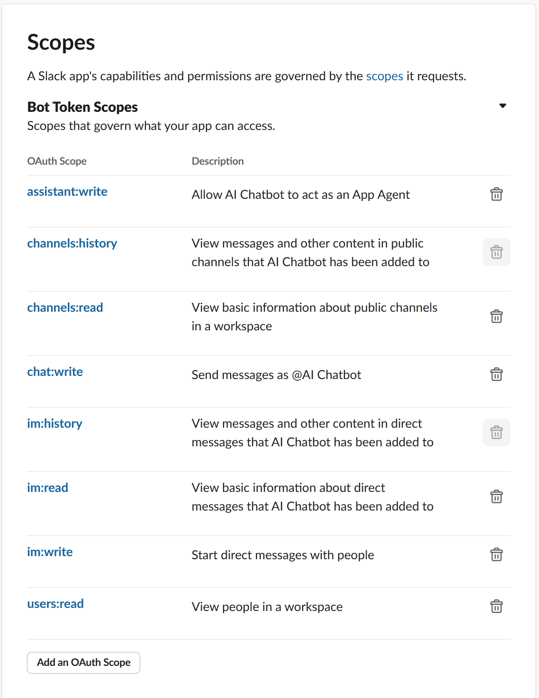

# rag-slack-bot

## This Slack bot is a Spring AI implementation that uses Retrieval Augmented Generation (RAG) and OpenAI LLM to automate channel responses.

This application runs as a standard Spring Boot application, but to respond to Slack Events you will need to [configure a Slack App](https://api.slack.com/apps) to send events.

When running locally, you will need to create a tunnel to localhost:8080 -- I use [ngrok](https://ngrok.com/)

`ngrok http http://localhost:8080` - this will produce a public URL you can use in your Slack Bot.

Go to https://api.slack.com/app and Create New App.

Select OAuth & Permissions

Scroll down to Scopes

Next go to Event Subscription and enable it.
Make sure the URL it formatted <ngrok URL>/slack/events
Then Subscribe to bot Events to the following events

Install the bot

## How to run

### You need a Chroma instance running - choose your own approach, but to run in Docker and mount a volume to keep data, use:

`docker run -d -v ./chroma-data:/data -p 8000:8000 chromadb/chroma`

### Environment Variables

`SPRING_AI_OPENAI_API_KEY` - set this to your OpanAI API Key

`SLACK_BOT_TOKEN` - set this to your Slack Bot token created when you configured your Slack App

## References

- [Spring AI](https://docs.spring.io/spring-ai/reference/index.html)
- [ChromaDB](https://www.trychroma.com/)
- [Slack App](https://api.slack.com/apps)
- [ngrok](https://ngrok.com/)
- [Swagger](http://localhost:8080/swagger-ui/index.html)